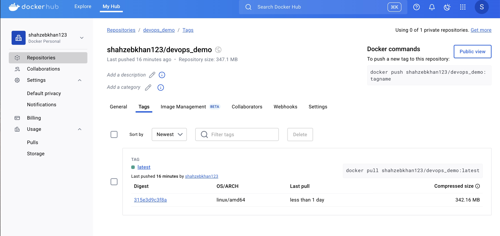

# IS218 Homework 8 – DevOps and Automation with Docker

This is my submission for Homework 8. The goal of this project was to use Docker and GitHub Actions to automatically test, build, and push a Docker image to Docker Hub.

I created a basic Python app with one function and one test, then added a CI/CD pipeline using GitHub Actions. The workflow installs dependencies, runs pytest, builds the Docker image, and pushes it to my Docker Hub account.

## What the App Does

- Contains a simple `start()` function in `app/__init__.py`
- Prints “Hello World” from `main.py`
- Has a test in `tests/start_test.py` to check if `start()` returns `True`

## CI/CD Pipeline

Every time I push to the `main` branch, GitHub Actions:

1. Checks out the code
2. Installs Python and dependencies
3. Runs the test
4. If test passes, it builds and pushes the Docker image to Docker Hub

### GitHub Actions Badge

## Docker Hub Image

You can pull the Docker image using: 

docker pull shahzebkhan123/devops_demo:latest

## Screenshot of Docker Image on Docker Hub

This screenshot shows that my GitHub Action successfully pushed the image to Docker Hub.

 

This repo builds and pushes a Docker image to [Docker Hub](https://hub.docker.com/r/shahzebkhan123/devops_demo/tags) using GitHub Actions CI/CD.

## GitHub Secrets

To make this work securely, I added these secrets to GitHub:

- `DOCKERHUB_USERNAME` – my Docker Hub username
- `DOCKERHUB_TOKEN` – access token generated in Docker Hub under Security

## Notes

- Everything was tested and pushed automatically
- The workflow only runs if tests pass
- This helps automate deployment using DevOps best practices

## Repo Link

[GitHub Repository](https://github.com/Shahzebkhan123/devops-docker-automation)
